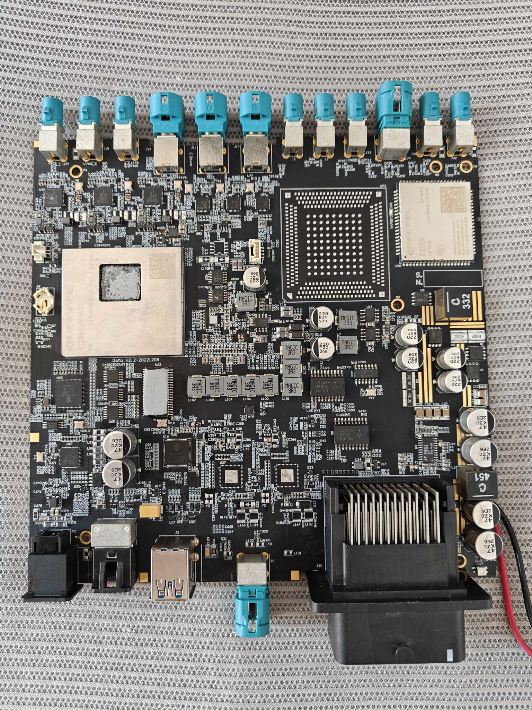
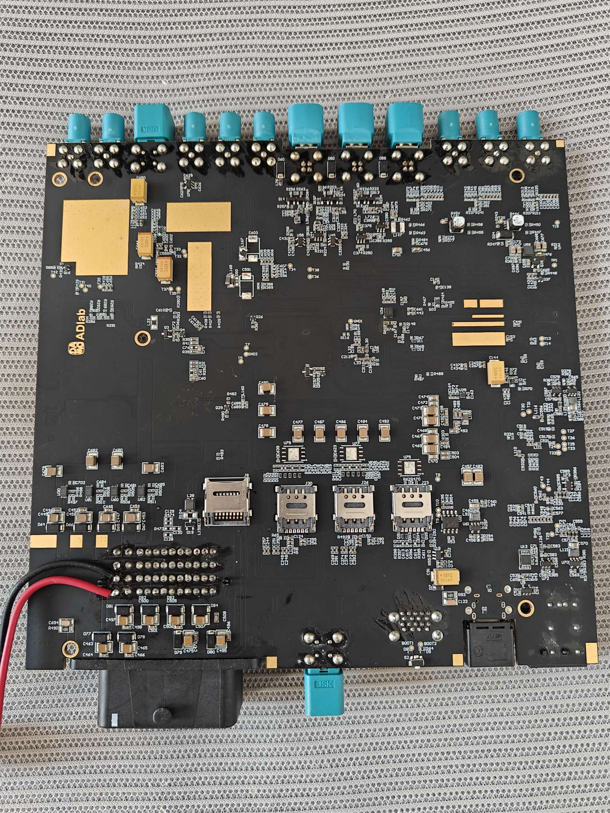
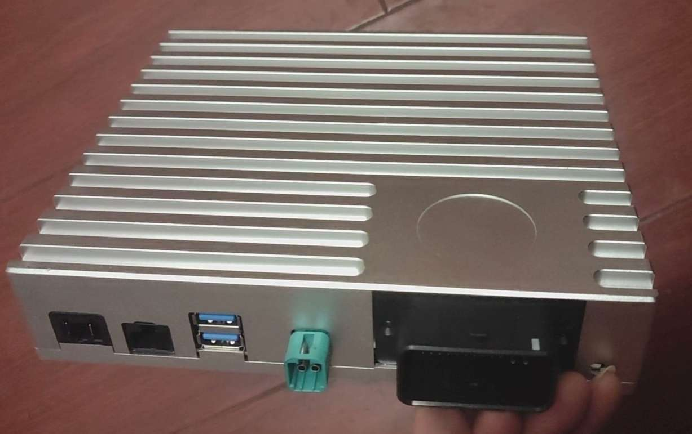
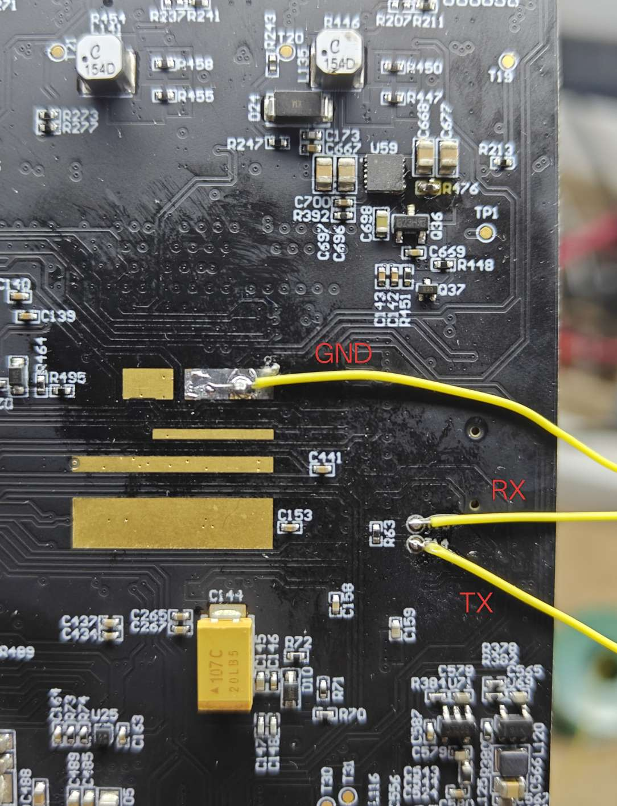
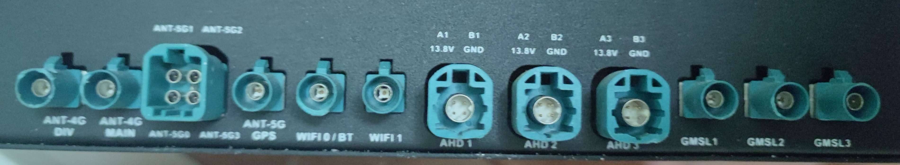
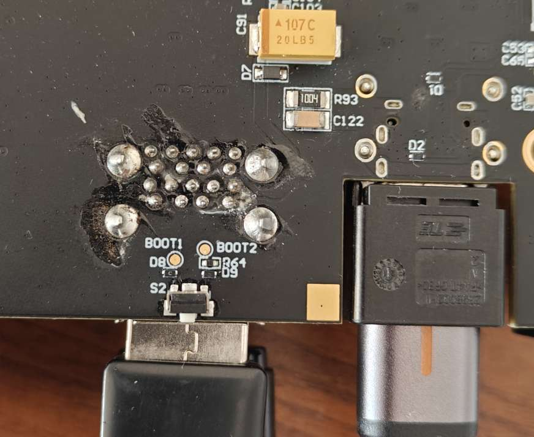

# 固件

[Armbian](https://github.com/retro98boy/armbian-build)

# 硬件

阿里巴巴达摩院[ADLab](https://github.com/ADLab-AutoDrive) QCS8250智能座舱域控制器，基于移远SG865W-WF模组

## 裸板及带壳外观







## 配置

Qualcomm QCS8250

WiFi6 BT5.1

LPDDR5 UFS

USB Type-A x2, up to 5Gbps

USB Type-C with DP Alt Mode x1, up to 10Gbps in pure USB mode

1000BASE-T1 x1

GMSL2 x3

CANFD x1

RS485 x1

## PIN

调试串口，高电平为1.8V。比较坑的点：不接SoC的RX，SoC的TX在XBL/ABL阶段也不会输出任何log



主连接器定义


后面板接口定义



EDL按钮，按住后再上电设备会进入EDL模式。按下按钮等于短接BOOT1和BOOT2触点

注意Type-C也会给设备供电，所以按按钮前，带电源输出的Type-C要断开



# 使用

## 备份原设备固件

由于只有移远SG865W-WF模组的EDL线刷包，肯定是不能很好的适配该设备的外设，且有些固件是针对不同设备修改过的，例如QUP。所以在调试之前先备份整个UFS

### 安装bkerler/edl

这里使用[bkerler/edl](https://github.com/bkerler/edl)实用程序，由于直接在host系统上安装该软件会污染rootfs，作者采用容器来隔离安装

下载仓库中的[Dockerfile](Dockerfile)到某处，然后在同级目录执行`docker buildx build -t retro98boy/bkerler-edl:latest .`构建容器镜像

构建完成后可以使用下面的命令来进入容器再使用edl实用程序，注意目录映射需要按照自己的需求来：

```
docker run -it --rm \
--name bkerler-edl \
--network host \
--privileged \
-v /dev:/dev \
-v ~/workspace:/workspace \
retro98boy/bkerler-edl:latest bash
```

当然也可以不进入bash，直接执行edl实用程序

按照的bkerler/edl仓库的README，在Linux下使用还需要安装“驱动”：一些UDEV规则和内核模块黑名单，见[此](https://github.com/bkerler/edl/blob/334028cd887a2960867750c403dbcad9cbe8c46b/install-linux-edl-drivers.sh)

由于我们使用root权限的容器，UDEV规则可以不安装。至于内核模块黑名单，在针对该设备使用的时候，实测可以不安装。内核模块黑名单在[此](https://github.com/bkerler/edl/blob/334028cd887a2960867750c403dbcad9cbe8c46b/Drivers/blacklist-qcserial.conf)，如果要屏蔽，请在host系统屏蔽

### 开始备份

首先获取bkerler/edl要使用的loader。从移远SG865W-WF模组的EDL线刷包中解压得到programmer：prog_firehose_8250_ddr.elf，将其放到host系统的某个目录，该目录应该被映射到容器中，然后执行：

```
root@NucBox-K6:/workspace# fhloaderparse /workspace/qualcomm/damo-cockpit8250 /usr/src/edl/Loaders
Capstone library is missing (optional).
Keystone library is missing (optional).
Duplicate: OEM:Qualcomm         MODEL:0000      HWID:0000000000000000   SWID:0000000000000003   SWSIZE: PK_HASH:bdaf51b59ba21d8a243792c0e183e88bddd369ccca58bc792a3e4c22eff329e8a8c72d449559cd5f09ebfa5c7bf398c0        /workspace/qualcomm/damo-cockpit8250/prog_firehose_8250_ddr.elf 699832  OEMVER:karl-OptiPlex-7090       QCVER:BOOT.XF.3.2-00392-SM8250-1        VAR:Soc8250LAA
root@NucBox-K6:/workspace# mv /usr/src/edl/Loaders/Duplicate/0000000000000000_bdaf51b59ba21d8a_fhprg.bin /workspace/qualcomm/damo-cockpit8250
```

最终`0000000000000000_bdaf51b59ba21d8a_fhprg.bin`就是需要的loader，该loader可以在本仓库的Releases界面下载

将设备进入EDL模式，再用Type-C线连接至PC，执行下面的命令来备份整个UFS：

```
# 备份所有LUN的GPT
edl --loader=./0000000000000000_bdaf51b59ba21d8a_fhprg.bin printgpt --memory=ufs > printgpt.txt

# 按分区来备份所有LUN上的分区
edl --loader=./0000000000000000_bdaf51b59ba21d8a_fhprg.bin rl partitions --memory=ufs --genxml

# 备份所有LUN
edl --loader=./0000000000000000_bdaf51b59ba21d8a_fhprg.bin rf flash.bin --memory=ufs
```

整个UFS备份可以在[此处](TODO)下载

## 刷入Armbian到UFS

首先刷入移远SG865W-WF模组的Ubuntu EDL线刷包`SG865WWFPUR50A01_BP01.001_Ubuntu18.04.5.01.001.zip`

在Windows PC上使用QFIL flat build刷入Ubuntu线刷包。记得刷入之前先对UFS进行provisioning（配置选provision_ufs31.xml），该步骤会为UFS分配LUN

然后通过Fastboot或者EDL刷入Armbian，这里选择EDL方式：

将内核刷入boot_a和boot_b。如果想玩Armbian+Android/xxx双系统，刷入一个槽位即可，但是要确保激活Armbian对应的槽位

```
edl --loader=./0000000000000000_bdaf51b59ba21d8a_fhprg.bin w boot_a Armbian-unofficial_25.11.0-trunk_Damo-cockpit8250_noble_current_6.12.58.boot_sm8250-damo-cockpit8250.img --memory=ufs --lun=4

edl --loader=./0000000000000000_bdaf51b59ba21d8a_fhprg.bin w boot_b Armbian-unofficial_25.11.0-trunk_Damo-cockpit8250_noble_current_6.12.58.boot_sm8250-damo-cockpit8250.img --memory=ufs --lun=4
```

将rootfs刷入userdata。userdata空间占整个UFS的大部分，用于存储Android用户数据。如果想玩Armbian+Android/xxx双系统，可提前将userdata分区缩小，再创建一个大小够用的分区用于刷入Armbian的rootfs

```
edl --loader=./0000000000000000_bdaf51b59ba21d8a_fhprg.bin w userdata Armbian-unofficial_25.11.0-trunk_Damo-cockpit8250_noble_current_6.12.58.rootfs.img --memory=ufs --lun=0
```

将空的dtbo刷入dtbo_a和dtbo_b。因为XBL/ABL加载内核和dtb后，会尝试应用dtbo，原厂的dtbo是不适用于主线dtb的，所以作者编译了一个空dtbo，不会修改dtb任何东西，也不会报错。只刷入一个槽位还是两个按照自己的需求

```
edl --loader=./0000000000000000_bdaf51b59ba21d8a_fhprg.bin w dtbo_a sm8250-damo-cockpit8250-dummy.dtbo --memory=ufs --lun=4

edl --loader=./0000000000000000_bdaf51b59ba21d8a_fhprg.bin w dtbo_b sm8250-damo-cockpit8250-dummy.dtbo --memory=ufs --lun=4
```

最后断电重启即可

## 从外置U盘启动Armbian

由于XBL/ABL引导内核的方式导致内核和dtb被打包在一起，如果想单独更新dtb则需要重新打包并dd到boot_a/boot_b，这在调试设备时非常麻烦。使用U-Boot则可以避免这个问题

切换到U-Boot后，引导内核的方式则增多了很多

网络有：PXE，NFS，TFTP

本地存储（UFS/USB）有：U-Boot script，extlinux，EFI（GRUB/systemd-boot）

这里作者选择USB加extlinux

在本仓库的Releases界面下载xbl-u-boot.mbn，然后刻录到xbl_a/xbl_b分区即可使用U-Boot：

```
edl --loader=./0000000000000000_bdaf51b59ba21d8a_fhprg.bin w xbl_a xbl-u-boot.mbn --memory=ufs --lun=1

edl --loader=./0000000000000000_bdaf51b59ba21d8a_fhprg.bin w xbl_b xbl-u-boot.mbn --memory=ufs --lun=2
```

然后将Armbian-unofficial_25.11.0-trunk_Damo-cockpit8250_noble_current_6.12.58.img刻录到U盘上，插入设备的Type-A开机即可

# 设备调试

## 编译U-Boot

U-Boot源码来自Linaro，适配该设备的源码仓库在[此处](https://github.com/retro98boy/qcomlt-u-boot)，分支damo-cockpit8250-debug

编译之前除了下载U-Boot源码，还需要下载qtestsign：

```
cd ~/workspace/qualcomm
git clone https://github.com/msm8916-mainline/qtestsign

# 作者使用的版本
git reset --hard f3df53a5f0e37ccee076541f30f9d5b8340fc2d3

# 安装到PATH
cd qtestsign
ln -svf $PWD/qtestsign.py ~/.local/bin/qtestsign
ln -svf $PWD/patchxbl.py ~/.local/bin/patchxbl
```

U-Boot编译命令：

```
# 删除旧的编译目录，即全量编译
rm -rf build

# 编译U-Boot
make -C . O=build CROSS_COMPILE=aarch64-linux-gnu- qcom_defconfig
make -C . O=build CROSS_COMPILE=aarch64-linux-gnu- -j$(nproc) DEVICE_TREE=qcom/sm8250-damo-cockpit8250

# 将U-Boot替换到XBL镜像中并重新签名
patchxbl -o build/xbl-u-boot.elf -c build/u-boot-dtb.bin ~/workspace/qualcomm/damo-cockpit8250/xbl.elf
qtestsign -v6 sbl1 -o build/xbl-u-boot.mbn build/xbl-u-boot.elf

# 最终得到xbl-u-boot.mbn，复制到某处待用
cp build/xbl-u-boot.mbn ~/workspace/qualcomm/damo-cockpit8250
```

上面的`~/workspace/qualcomm/damo-cockpit8250/xbl.elf`来自移远SG865W-WF模组的Android EDL线刷包`SG865WWFPAR03A01_BA03BP01K0M01V01_AP13.0.0.01.001V01.zip`

# 相关链接

[Initial U-Boot release for Qualcomm platforms](https://www.linaro.org/blog/initial-u-boot-release-for-qualcomm-platforms/)
